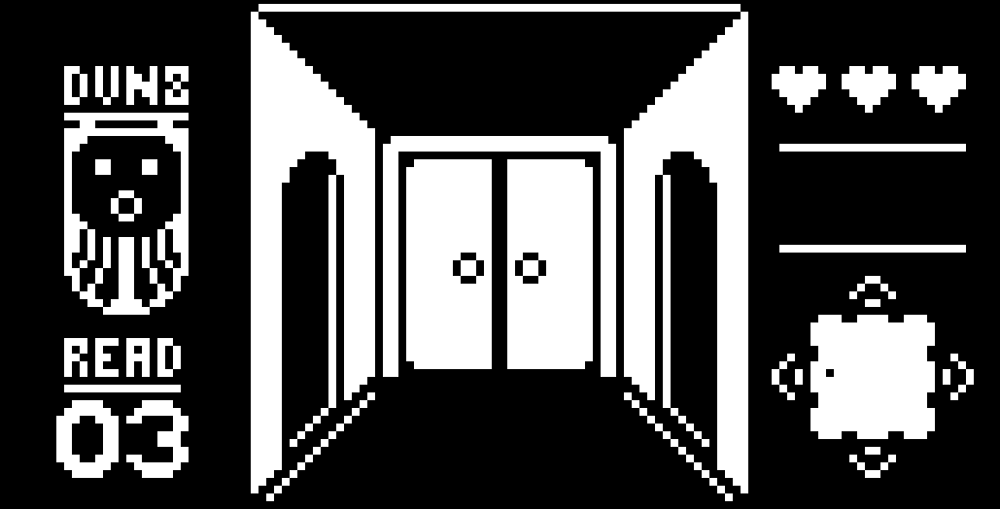
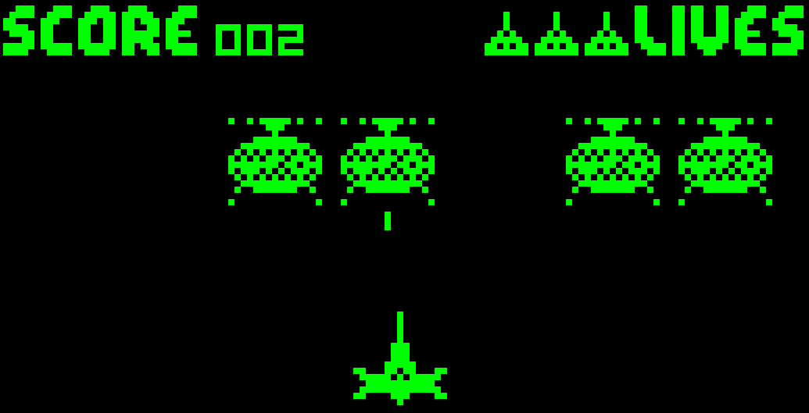
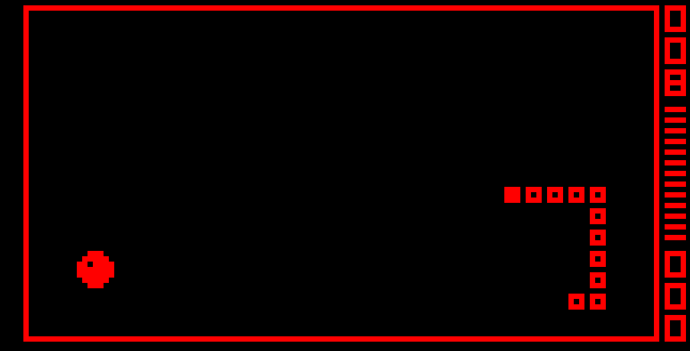
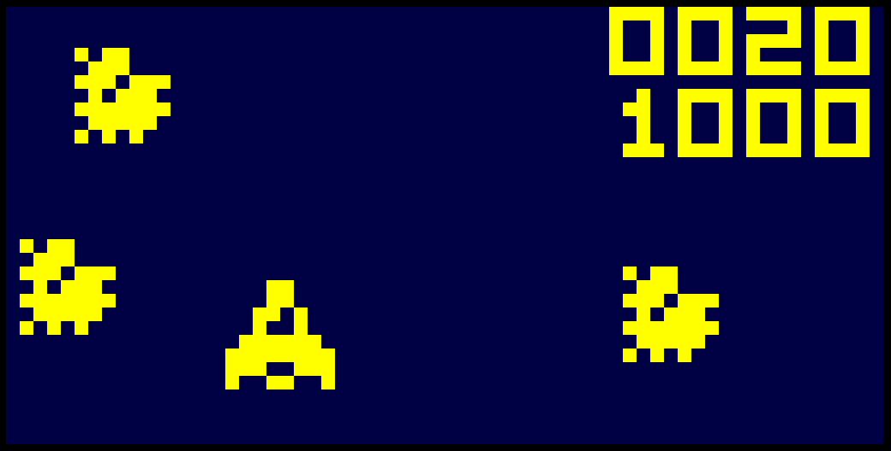
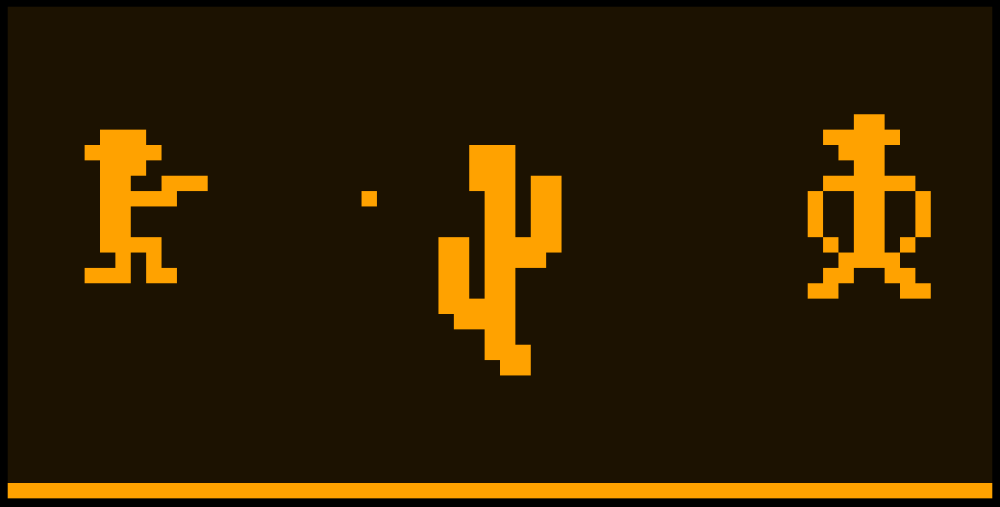
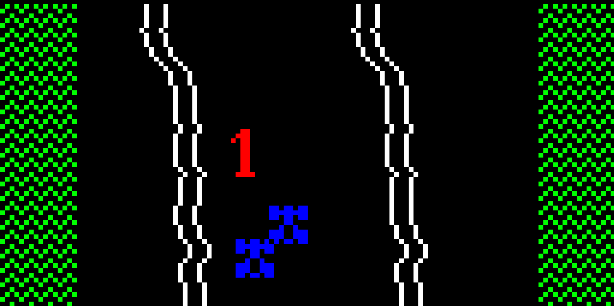
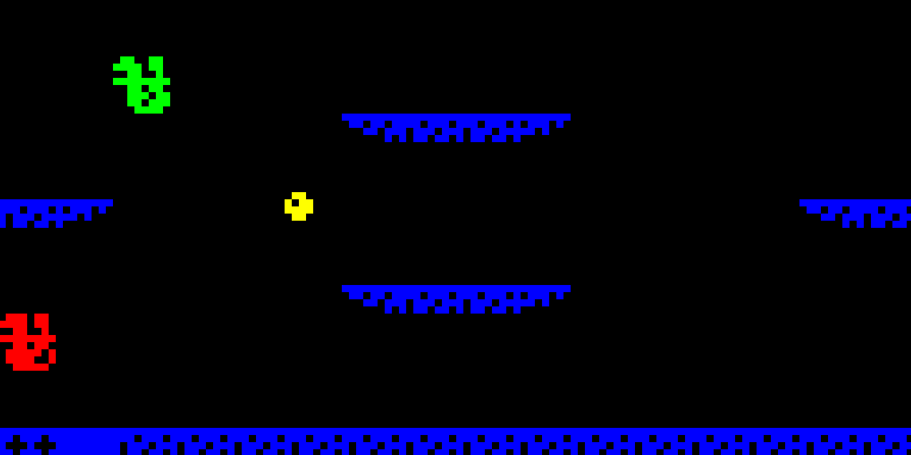
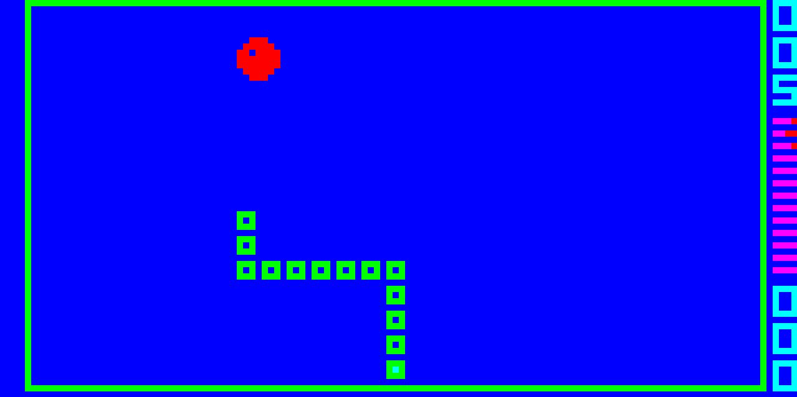
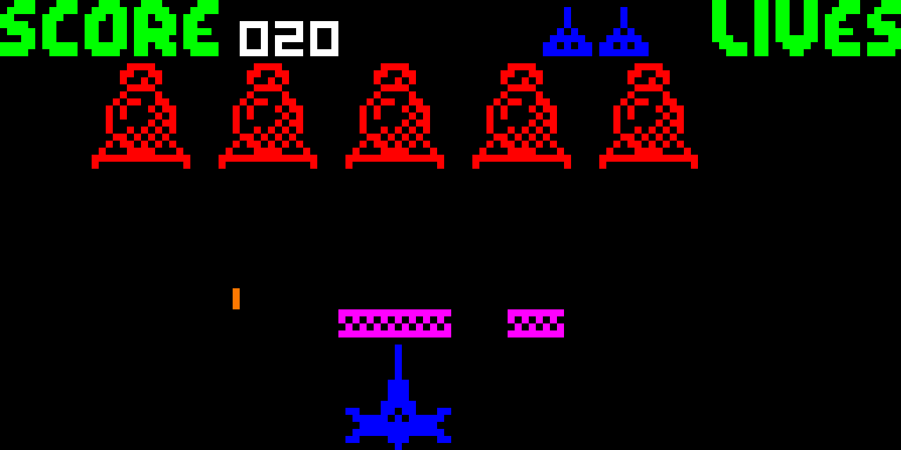

# Go CHIP-8

This is (yet another) CHIP-8 and Super CHIP-8 emulator written in Go. Yes there are many others but this one is mine.

What is CHIP-8? It's a simple 8-bit virtual machine developed in the 1970s, which found new life in the 90s on HP graphing calculators. It's become the defacto "hello world" for emulator developers to get started with.

https://en.wikipedia.org/wiki/CHIP-8

### Screenshots

 
 
 

Goals:

- Write my first emulator
- Learn about virtual machine development (no, I mean _real_ [virtual machines](https://wiki.c2.com/?VirtualMachine), not that ugly IaaS stuff)
- Have fun

Features:

- WASM support, playable in browser as well as Linux and Windows binaries
- Super CHIP-8 support (v1.1)
- Configurable speed, colors
- Builtin debugger

Supporting technologies and libraries:

- [Ebiten](https://github.com/hajimehoshi/ebiten)

## Status


# Getting Started

## Try web version

Online WASM version is playable here with a set of roms/programs provided

https://code.benco.io/chip8/web/

## Installing & Running

Download from [releases](https://github.com/benc-uk/chip8/releases), unzip/untar and run :)

```text
chip8 <flags> <program-filename>

  -bg int
        Colour of background, pallette index: 0-8 (default 0)
  -fg int
        Colour of foreground pixels, pallette index: 0-8 (default 2)
  -nocolour
        Force mono mode even if a colour map file is found
  -pallette string
        Colour pallette; spectrum, c64 or vaporwave (default "spectrum")
  -scale int
        Size of pixels, default results in a 640x320 window (default 10)
  -speed int
        Speed of the emulator in cycles per tick (default 12)
  -debug int
        0 = off, 1 = sprites only, 2 = full        
```

## Controls

The keys on the left hand side of the keyboard are mapped to the 16 keys of the CHIP-8 "keypad" as follows:


In addition the emulator provides several other keys

- **F5** - Pause the system
- **F6** - Step through instructions (useful when debug is enabled)
- **F11** - Enable debugger, which will be output to stdout or the browser console
- **F12** - Reset system and reload the program
- **[** - Slow down the emulator speed
- **]** - Increase the emulator speed

## Colour Support

This emulator supports two main colour modes, both modes have 9 colours (black and 8 other colours) and comes with three builtin colour pallettes:

 - Spectrum: Bright colours, taken from the ZX Spectrum
 - C64: Less bright colours, taken from the Commodore 64
 - Vaporwave: Less saturated pastel tones 

The pallettes are all indexed the same:

0. Black 
1. White
2. Red
3. Green
4. Blue
5. Magenta / Pink
6. Yellow
7. Cyan / Light Blue
8. Orange

### Mode: 1-Bit Monochrome 

This is the default mode, in this mode you can specify the foreground colour (for pixels set to 1) and background colour (for pixels that are 0), the colours are specified as a value between 0 and 8 for the pallette index. Defualts are 0 (black) for background and 2 (green) for foreground

### Mode: Multi-Colour Mapping

This is a special mode, unique (AFAIK) to this emulator and it attempts to add multi-colour support to the CHIP-8 system without the need for any software or system changes (i.e. it can work with ALL existing ROMs, games and programs), and supports with both CHIP-8 and Super CHIP-8 software

 
 

This mode is only enabled if a colour mapping file is found.  
Colour mapping files are YAML files named as follows `{rom-name}.colours.yaml` and should be in the same directory as the ROM file, e.g. of you were loading the following program ROM `roms/stuff/foo.ch8`, the mapping file looked for would be `roms/stuff/foo.ch8.colours.yaml`

If this file is not found this mode is disabled and the emulator defaults back to 1-bit mode. 

In summary this mode relies on mapping sprite addresses in memory with colour (pallette index) values. e.g. if the program stored the sprite for an enemy space ship at address 0xA40 we could decide to draw that sprite in green, but the sprite stored at 0xA58 could be shown in red.

The mapping file syntax is a little complex but a summary and example follows:

```yaml
background: 0 # black background
default: 3 # make foreground color green
sprites:
  '0AF8': 2 # sprite we want in red
  '0A68': 4 # sprite we want in blue
  '0A88': 4 # sprite we want in blue
ranges:
  - colour: 6 # a range of sprites in yellow
    start: '0B18'
    end: '0B30'
  - colour: 1 # a range of sprites in white
    start: '0B5C'
    end: '0BBC'
```

In order to aid creation of these files a special debug mode `-debug=1` is included, which will output the addresses of sprites the first time they are drawn.

TODO: Full explanation / reference for *.colours.yaml* files

Check out the roms directory in this repo for some example colour mapping files

## Developing & building locally

```text
$ make
build                🔨 Run a local build
help                 💬 This help message :)
lint-fix             📝 Lint & format, will try to fix errors and modify code
lint                 🔍 Lint & format, will not fix but sets exit code on error
run                  🏃‍ Run application, used for local development
test                 🤡 Run those unit tests and pretend you have no bugs
```

### Building (Linux)

Install pre-reqs:

- Golang 1.16.x
- make,
- gcc
- Packages: `xorg-dev`, `libasound2-dev` (For Ubuntu/Debian)

Then simply run `make build`, the executable binaries are output to ./bin/ the WASM version is placed into ./web/

Note. Even when building under Linux, the Windows version will be built too

# Repository Structure

A brief description of the top-level directories of this project are:

```text
/cmd        - Main apps, both standalone and WASM versions
/docs       - Docs, not much here
/pkg        - Go packages and modules, most of the code is here
/roms       - A handful of CHIP8 ROMs and programs for testing
/web        - Web / WASM version
```

# Known Issues

- On Windows the first time bleep is output, it is sometimes silent
- Linux, no sound because I can't test it
- Some of the games from [chip8Archive](https://github.com/JohnEarnest/chip8Archive) do not work. However testing with several other CHIP-8 emulators, I saw the same behavior. Those games seem to only run in the Octo emulator.

# Acknowledgements & Links

I used the following links (among others) when writing this emulator

- Great archive of CHIP-8 links - https://chip-8.github.io/links/
- INCREDIBLE blog post how to write a CHIP-8 emulator - https://tobiasvl.github.io/blog/write-a-chip-8-emulator/
- Cowgod's Chip-8 technical reference http://devernay.free.fr/hacks/chip8/C8TECH10.HTM
- Very good emulator written in Go I used a lot as a reference - https://github.com/massung/CHIP-8
- Guide to different CHIP-8 versions - https://chip-8.github.io/extensions/
- Another great reference - https://github.com/mattmikolay/chip-8/wiki 