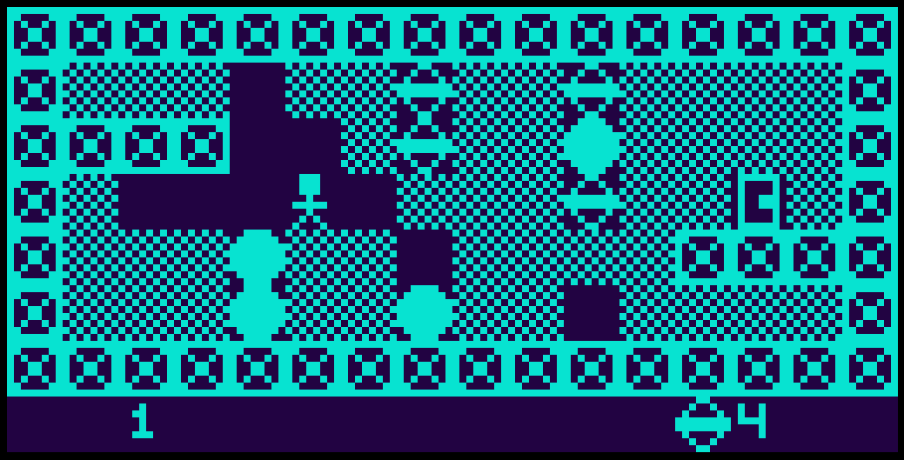

# Go CHIP-8

This is (yet another) CHIP-8 and Super CHIP-8 emulator written in Go. Yes there are many others but this one is mine.

What is CHIP-8? It's a simple 8-bit virtual machine developed in the 1970s, which found new life in the 90s on HP graphing calculators. It's become the defacto "hello world" for emulator developers to get started with.

https://en.wikipedia.org/wiki/CHIP-8

### Screenshots

 
 
 

Goals:

- Write my first emulator
- Learn about virtual machine development (no, I mean _real_ [virtual machines](https://wiki.c2.com/?VirtualMachine), not that ugly IaaS stuff)
- Have fun

Features:

- WASM support, playable in browser as well as Linux and Windows binaries
- Super CHIP-8 support (v1.1)
- Configurable speed, colors
- Builtin debugger

Supporting technologies and libraries:

- [Ebiten](https://github.com/hajimehoshi/ebiten)

## Status


# Getting Started

## Try web version

Online WASM version is playable here with a set of roms/programs provided

https://code.benco.io/chip8/web/

## Installing & Running

Download from [releases](https://github.com/benc-uk/chip8/releases), unzip/untar and run :)

```text
chip8 <flags> <program-filename>

  -debug
        Enable debug, lots of output & very slow
  -scale int
        Size of pixels, default results in a 640x320 window (default 10)
  -speed int
        Speed of the emulator in cycles per tick (default 12)
  -bg-colour string
        Colour of background in hex (default "#000000")
  -fg-colour string
        Colour of foreground pixels hex (default "#22DD22")
```

## Controls

The keys on the left hand side of the keyboard are mapped to the 16 keys of the CHIP-8 "keypad" as follows:


In addition the emulator provides several other keys

- **F5** - Pause the system
- **F6** - Step through instructions (useful when debug is enabled)
- **F11** - Enable debugger, which will be output to stdout or the browser console
- **F12** - Reset system and reload the program

## Developing & building locally

```text
$ make
build                🔨 Run a local build
help                 💬 This help message :)
lint-fix             📝 Lint & format, will try to fix errors and modify code
lint                 🔍 Lint & format, will not fix but sets exit code on error
run                  🏃‍ Run application, used for local development
test                 🤡 Run those unit tests and pretend you have no bugs
```

### Building (Linux)

Install pre-reqs:

- Golang 1.16.x
- make,
- gcc
- Packages: `xorg-dev`, `libasound2-dev` (For Ubuntu/Debian)

Then simply run `make build`, the executable binaries are output to ./bin/ the WASM version is placed into ./web/

Note. Even when building under Linux, the Windows version will be built too

# Repository Structure

A brief description of the top-level directories of this project are:

```text
/cmd        - Main apps, both standalone and WASM versions
/docs       - Docs, not much here
/pkg        - Go packages and modules, most of the code is here
/roms       - A handful of CHIP8 ROMs and programs for testing
/web        - Web / WASM version
```

# Known Issues

- On Windows the first time bleep is output, it is sometimes silent
- Linux, no sound because I can't test it
- Some of the games from [chip8Archive](https://github.com/JohnEarnest/chip8Archive) do not work. However testing with several other CHIP-8 emulators, I saw the same behavior. Those games seem to only run in the Octo emulator.

# Acknowledgements & Links

I used the following links (among others) when writing this emulator

- Great archive of CHIP-8 links - https://chip-8.github.io/links/
- INCREDIBLE blog post how to write a CHIP-8 emulator - https://tobiasvl.github.io/blog/write-a-chip-8-emulator/
- Cowgod's Chip-8 technical reference http://devernay.free.fr/hacks/chip8/C8TECH10.HTM
- Very good emulator written in Go I used a lot as a reference - https://github.com/massung/CHIP-8
- Guide to different CHIP-8 versions - https://chip-8.github.io/extensions/
- Another great reference - https://github.com/mattmikolay/chip-8/wiki 